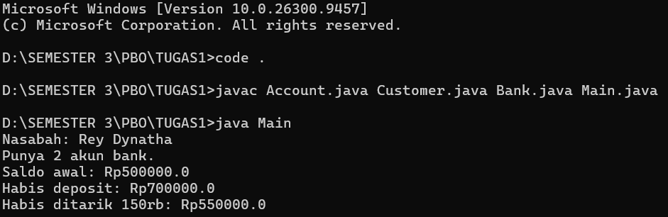

<div align="center">

# 🏦 Simple Banking System

**Simulasi sistem perbankan sederhana berbasis Java & Object-Oriented Programming**


*Kelola nasabah, buka banyak akun, deposit, dan tarik saldo — semuanya lewat kode Java yang bersih dan terstruktur.* 💸

</div>

---

## 📖 Tentang Proyek

Proyek ini adalah implementasi sistem perbankan mini yang dibuat untuk mempraktikkan konsep **Object-Oriented Programming (OOP)** di Java, seperti **encapsulation**, **class & object**, serta **relasi antar class** (*composition*).

Dalam sistem ini, sebuah **Bank** dapat memiliki banyak **Customer**, dan setiap **Customer** dapat memiliki lebih dari satu **Account** dengan saldo masing-masing.

## ✨ Fitur

- 👥 **Manajemen Nasabah** — tambah nasabah baru ke bank dan ambil datanya berdasarkan indeks
- 💳 **Multi Akun** — satu nasabah bisa punya banyak akun (menggunakan `ArrayList`)
- 💰 **Deposit** — tambah saldo dengan validasi (hanya nominal positif)
- 🏧 **Withdraw** — tarik saldo dengan pengecekan kecukupan dana
- 🛡️ **Encapsulation** — semua atribut bersifat `private` dan diakses lewat method
- 🚧 **Proteksi Kapasitas** — mencegah `ArrayIndexOutOfBoundsException` saat bank penuh

## 📸 Hasil Output



## 🧩 Struktur Class

```
📦 Simple-Banking-System
 ┣ 📜 Main.java       → Titik masuk program & pengujian
 ┣ 📜 Bank.java       → Menyimpan & mengelola daftar nasabah
 ┣ 📜 Customer.java   → Data nasabah & daftar akun miliknya
 ┗ 📜 Account.java    → Saldo, deposit, dan withdraw
```

### Relasi Antar Class

```
 Bank  ──1────*──▶  Customer  ──1────*──▶  Account
(max 10 nasabah)   (banyak akun)         (saldo & transaksi)
```

| Class | Tanggung Jawab | Method Utama |
|-------|----------------|--------------|
| `Account` | Mengelola saldo | `getBalance()`, `deposit()`, `withdraw()` |
| `Customer` | Menyimpan identitas & akun nasabah | `getFirstName()`, `getLastName()`, `setAccount()`, `getAccount()`, `getNumOfAccounts()` |
| `Bank` | Menyimpan kumpulan nasabah | `addCustomer()`, `getCustomer()`, `getNumOfCustomers()` |
| `Main` | Menjalankan simulasi | `main()` |

## 🚀 Cara Menjalankan

### Prasyarat
- ☕ **JDK 8** atau lebih baru

Cek instalasi Java kamu:
```bash
java -version
```

### Langkah-langkah

**1. Clone repository**
```bash
git clone https://github.com/<username>/<nama-repo>.git
cd <nama-repo>
```

**2. Compile semua file**
```bash
javac *.java
```

**3. Jalankan program**
```bash
java Main
```

## 🖥️ Contoh Output

```
Nasabah: Rey Dynatha
Punya 2 akun bank.
Saldo awal: Rp500000.0
Habis deposit: Rp700000.0
Habis ditarik 150rb: Rp550000.0
```

## 🔍 Alur Simulasi di `Main.java`

1. Membuat objek `Bank`
2. Menambahkan 2 nasabah: **Rey Dynatha** dan **Iqbul Mauluddin**
3. Mengambil nasabah pertama, lalu membuatkan 2 akun (Rp500.000 & Rp1.500.000)
4. Menampilkan nama nasabah dan jumlah akunnya
5. Melakukan **deposit Rp200.000** dan **withdraw Rp150.000** pada akun pertama

## 💡 Konsep OOP yang Diterapkan

| Konsep | Penerapan |
|--------|-----------|
| **Encapsulation** | Atribut `private` + getter/method publik |
| **Constructor** | Inisialisasi saldo awal & data nasabah |
| **Composition** | `Bank` memiliki `Customer`, `Customer` memiliki `Account` |
| **Validasi Data** | Deposit hanya untuk nominal > 0, withdraw hanya jika saldo cukup |
| **Collections** | `ArrayList<Account>` untuk daftar akun dinamis |

## 🛣️ Rencana Pengembangan

- [ ] Validasi nominal negatif pada `withdraw()`
- [ ] Menu interaktif dengan input dari pengguna (`Scanner`)
- [ ] Fitur transfer antar akun
- [ ] Riwayat transaksi
- [ ] Penyimpanan data ke file / database

## 👨‍💻 Identitas Pembuat

| | |
|---|---|
| 👤 **Nama** | I Putu Reynanda Putra Dynatha |
| 🆔 **NIM** | F1D02510115 |
| 🏫 **Kelas** | 3B |

Dibuat dengan ☕ dan semangat belajar Java.

---

<div align="center">

⭐ Kalau proyek ini membantu, jangan lupa kasih **star** ya! ⭐

</div>
